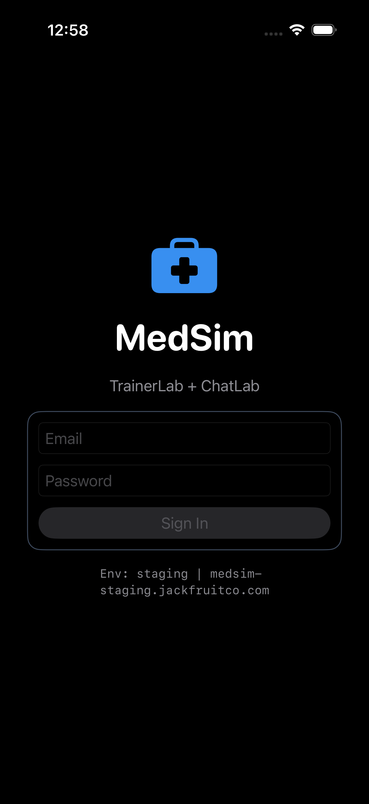
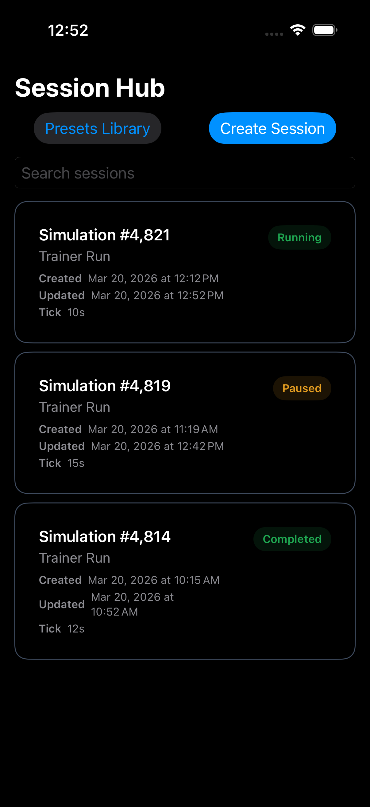
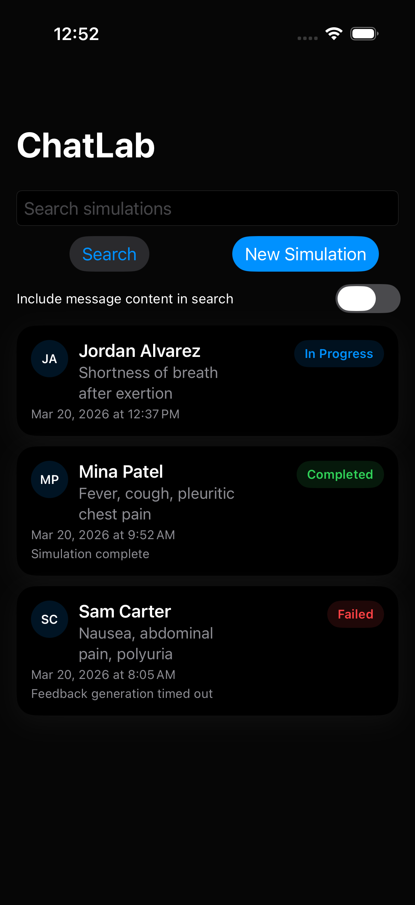

# MedSim iOS
[](https://github.com/jackfruitco/MedSim-iOS/actions/workflows/ci.yml) [](https://github.com/jackfruitco/MedSim-iOS/actions/workflows/ci.yml) [](https://github.com/jackfruitco/MedSim-iOS/actions/workflows/codeql.yml)

MedSim iOS is the native shell app for MedSim's internal simulation workflows. It ships two product surfaces in one app:

- TrainerLab for running, steering, and reviewing live trainer simulations
- ChatLab for browsing and working patient simulations through the messaging runtime

The repo is organized as an Xcode app plus local Swift packages so the app shell, feature modules, and shared infrastructure can evolve independently while still shipping together.

## UI

### Auth Gate



### TrainerLab Session Hub



### ChatLab Home



## Repo Layout

- `MedSim/`: the iOS app target and app entry point
- `apps/medsim-shell-ios/`: app shell routing, workspace selection, and shared composition
- `apps/trainerlab-ios/`: TrainerLab auth, session hub, run console, presets, summary, networking, realtime, persistence, design system, and shared models
- `apps/chatlab-ios/`: ChatLab home, conversation runtime, tools, and service layer
- `MedSimTests/` and `MedSimUITests/`: app-level unit and UI coverage
- `docs/api/`: API compatibility and discrepancy notes

## What the App Does

### TrainerLab

- Signs instructors into the MedSim backend
- Lists trainer sessions in the Session Hub
- Opens a live run console with vitals, timeline, patient state, and command tools
- Presents post-run summaries and debrief information

### ChatLab

- Searches existing chat simulations
- Starts new patient simulations
- Opens the conversation workspace and tools panel for a simulation
- Refreshes simulation state and tool data from the MedSim backend

### Shared Shell

- Hosts both internal apps behind one MedSim entry point
- Shares environment selection, authentication state, network configuration, and persistence primitives
- Locks orientation for the run console when needed on iPad

## Getting Started

### Requirements

- Xcode 26 or newer
- An iOS 26 simulator or device
- MedSim backend credentials if you want to sign in to a live environment

### Open the Project

Open `MedSim.xcodeproj` in Xcode, select the `MedSim` scheme, and run the app on an iPhone or iPad simulator/device.

The sign-in screen includes a hidden environment switcher. Long-press the environment label to switch between Production, Staging, Local HTTP, or a custom HTTPS base URL.

## Useful Commands

Build the app:

```sh
xcodebuild -project MedSim.xcodeproj -scheme MedSim -destination 'generic/platform=iOS' build
```

Run tests:

```sh
xcodebuild -project MedSim.xcodeproj -scheme MedSim -destination 'platform=iOS Simulator,name=iPhone 17 Pro' test
```

If you are working on a specific module, Xcode also exposes package schemes such as `AppShell`, `Auth`, `Sessions`, `RunConsole`, `Summary`, and `ChatLabiOS`.
